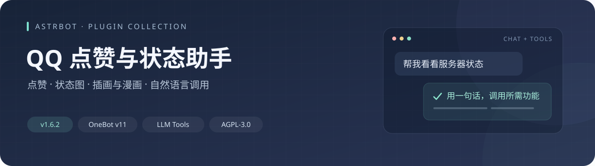
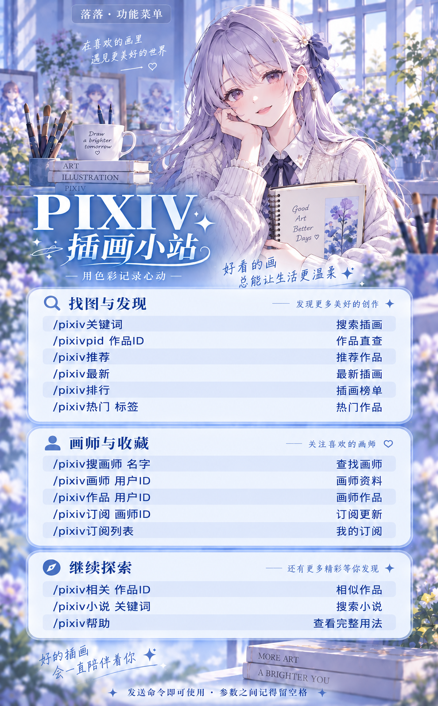

<p align="center">
  
</p>

<h1 align="center">QQ 点赞与状态助手</h1>

<p align="center">
  把常用的机器人功能，放进同一个插件。<br>
  <strong>QQ 点赞 · 服务器状态 · Pixiv · PICA · JM · LLM 工具调用</strong>
</p>

<p align="center">
  <a href="#quick-start">快速开始</a> ·
  <a href="#commands">命令手册</a> ·
  <a href="#llm">自然语言调用</a> ·
  <a href="#reader">阅读服务</a> ·
  <a href="#configuration">配置说明</a> ·
  <a href="#faq">常见问题</a> ·
  <a href="#changelog">更新记录</a>
</p>

---

## ✨ 功能一览

| 模块 | 可以做什么 | 使用亮点 |
| :--- | :--- | :--- |
| 👍 **QQ 点赞** | 给自己、指定 QQ 或被 @ 的用户点赞 | 分批处理、冷却控制、自然语言调用 |
| 📊 **服务器状态** | 查看 CPU、内存、磁盘、网络与容器信息 | 图片展示，提供普通、Pro、Debug 模式 |
| 🎨 **Pixiv** | 搜插画、查作品、看榜单、订阅画师、阅读小说 | 图片帮助、原图链接、Fanbox 相关功能 |
| 📚 **PICA** | 搜索、排行、分类、收藏、签到与漫画下载 | 用户独立绑定账号，支持整本与选章下载 |
| 📖 **JM** | 搜索、详情、章节目录、月榜、总榜与下载 | 引用搜索回复，榜单每 50 条转发，群发送失败转私聊 |
| 💬 **自然语言** | 让模型调用插件已有功能 | JM / PICA 返回真实漫画 ID，可继续说“下载第二本” |

**当前版本：v1.6.3** · 插件名：`astrbot_plugin_qq_like` · 作者：`wzq10314`

[GitHub 仓库](https://github.com/wzq10314/astrbot_plugin_qq_like) · [发布版本](https://github.com/wzq10314/astrbot_plugin_qq_like/releases) · [问题反馈](https://github.com/wzq10314/astrbot_plugin_qq_like/issues)

**这是 AstrBot 整合适配版，不是各上游作者的官方发布。感谢原作者开放源码。**

> **环境说明**：插件声明支持 AstrBot `>=4.28.1,<5`，支持 `aiocqhttp / OneBot v11`，并按平台能力适配 `qq_official` 与 `qq_official_webhook`。已有部署在 **AstrBot 4.28.2 + Python 3.12 + NapCat / QQ 官方机器人** 环境使用；Webhook 及其他版本请按实际开放权限验证。

QQ 官方机器人可使用状态查询、Pixiv / PICA / JM 查询、菜单和自然语言工具；图文卡片与点击按钮需安装配套的 [QQ 官方卡片插件](https://github.com/wzq10314/astrbot_plugin_official_cards)。官方 OpenID 与普通 QQ 号分开绑定账号，管理员名单也需填写官方平台的用户标识。**名片点赞仍仅支持 NapCat**；官方平台没有合并聊天记录和群文件能力时，会使用普通回复或已配置的阅读网页链接。接口权限、内容审核、主动发送限制与网络配置仍按 QQ 官方平台实际能力处理。

PICA、JM 为成人向平台，功能默认关闭，按需启用。Pixiv 的 `r18_mode` 默认为“过滤 R18”，`ai_filter_mode` 默认为“显示 AI 作品”；具体工具的行为见下文。

## 🖼️ 图片菜单

三套菜单风格统一，可直接在聊天中打开。点击缩略图查看大图。

<table>
  <tr>
    <th align="center">Pixiv · 插画小站</th>
    <th align="center">PICA · 漫画小屋</th>
    <th align="center">JM · 漫画小屋</th>
  </tr>
  <tr>
    <td width="33%"><a href="assets/menus/pixiv-help-v3.png"></a></td>
    <td width="33%"><a href="assets/menus/pica-help-v1.png"></a></td>
    <td width="33%"><a href="assets/menus/jm-help-v2.png"></a></td>
  </tr>
  <tr>
    <td align="center"><code>/pixiv帮助</code></td>
    <td align="center"><code>/pica帮助</code></td>
    <td align="center"><code>/jm帮助</code></td>
  </tr>
</table>

`menu_bot_name` 可自定义菜单上的机器人名称；留空时读取当前机器人昵称。图片为内置样式示例，完整参数以本文命令表为准。需要纯文字时，在帮助命令后添加 `文字`，例如 `/jm帮助 文字`。

<a id="quick-start"></a>

## 🚀 快速开始

### 1. 安装插件

在 AstrBot 插件管理中通过下面的仓库地址安装，也可以上传 [Release 安装包](https://github.com/wzq10314/astrbot_plugin_qq_like/releases/latest)。安装完成后打开插件配置。

```text
https://github.com/wzq10314/astrbot_plugin_qq_like
```

安装包内已包含 [`requirements.txt`](requirements.txt)，供 AstrBot 安装 Python 依赖。其中包含 `jmcomic` 和 `img2pdf`；JM 初始化也启用了缺失依赖自动补装。安装环境需要能访问 Python 包源，并允许安装依赖。

### 2. 开启需要的功能

| 想使用的功能 | 最少需要配置 |
| :--- | :--- |
| QQ 点赞 | `enabled: true`，默认开启；仅 OneBot / NapCat |
| 服务器状态 | `status_enabled: true`，默认开启 |
| Pixiv | 填写有效的 `refresh_token`；按网络情况配置代理 |
| PICA | 设置 `pica_enabled: true`，然后在私聊中绑定账号，或使用管理员配置的默认账号 |
| JM | 设置 `jm_enabled: true`；按网络情况配置 JM 代理与域名 |
| 自然语言调用 | 在 AstrBot 中配置支持工具调用的模型，并启用对应工具与功能开关 |

保存配置后重载插件。完整字段以 AstrBot 配置页面及 [`_conf_schema.json`](_conf_schema.json) 为准。

### 3. 发送第一条命令

```text
#点赞帮助
#状态
/pixiv帮助
/pica帮助
/jm帮助
```

PICA / JM 的帮助入口需要先启用对应功能。美化状态图和自定义名称菜单使用 Chromium / Chrome，可通过 `status_browser_path` 指定浏览器路径。缺少浏览器时，状态图会尝试基础渲染，JM 菜单可使用内置图片，PICA / Pixiv 菜单可回退到文字帮助。安装 Playwright 的 Python 包不等于安装好了浏览器。

<a id="commands"></a>

## 🧭 命令手册

**阅读约定**：`<参数>` 为必填，`[参数]` 为可选；实际发送时去掉尖括号和方括号。参数之间留空格，`@用户` 指 QQ 的真实 @ 消息。本文用 `#` 展示点赞与状态命令，用 `/` 展示平台命令；平台命令前缀需与 AstrBot 的唤醒前缀配置一致。

### 👍 点赞与状态

| 命令 | 用途 |
| :--- | :--- |
| `#赞我 [次数]` | 给自己点赞 |
| `#点赞 <QQ号> [次数]` | 给指定 QQ 点赞 |
| `#赞他 @用户 [次数]` | 给被 @ 的用户点赞 |
| `#点赞帮助` | 查看点赞用法 |
| `#状态` | 基础状态图 |
| `#状态pro` | 详细状态图，含负载、交换空间、线程及容器信息 |
| `#状态debug` / `#状态prodebug` | 诊断模式，仅 AstrBot 管理员可用 |
| `#扩展帮助` | 查看状态功能帮助 |

点赞次数范围为 **1～50**，默认申请 50 次；实际生效次数受 QQ 限制。`status_admin_only` 可限制普通状态查询权限，Debug 模式始终仅管理员可用。

### 📖 JM 漫画

| 命令 | 用途 | 常用别名 |
| :--- | :--- | :--- |
| `/jm搜索 <关键词> [页码]` | 搜索漫画，引用原查询回复 | `/jmsearch` |
| `/jm月排行 [页码]` | 按浏览量查看月榜 | `/jm月榜`、`/jmmonth` |
| `/jm总排行 [页码]` | 按浏览量查看全部时间总榜 | `/jm总榜`、`/jmall` |
| `/jm详情 <ID>` | 查看漫画详情 | `/jminfo` |
| `/jm章节 <ID>` | 查看章节目录 | `/jmchapters` |
| `/jm下载 <ID> [章节]` | 整本或选章下载 | `/jmdl` |
| `/jm` / `/jm帮助 [文字]` | 打开图片或文字帮助 | `/jmhelp` |
| `/jm清理 [天数]` | 按天数清理；省略天数清空缓存 | `/jmclean` |

#### 按章节下载

先用 `/jm章节 <ID>` 查看目录，再按 **从 1 开始的目录序号** 选择章节。

| 写法 | 下载内容 |
| :--- | :--- |
| `/jm下载 <ID>` | 整本 |
| `/jm下载 <ID> 2` | 第 2 章 |
| `/jm下载 <ID> 1-5` | 第 1～5 章 |
| `/jm下载 <ID> 1,3,7` | 第 1、3、7 章 |
| `/jm下载 <ID> 1-3,7` | 第 1～3 章与第 7 章 |

PICA 的 `/pica下载` 同样支持这些写法，请以 `/pica章节` 显示的章节号为准。多章、整本下载在后台执行，收到“开始下载”提示不代表文件已发送完成。

配置了独立阅读器服务时可返回网页阅读链接；未配置时走现有文件发送流程。仓库随附 [`reader/`](reader/) 服务源码，需要另行部署，详见[阅读服务说明](#reader)。

#### 榜单如何发送

月榜、总榜默认查询第 1 页，例如 `/jm月排行 2` 查看第 2 页。榜单序号表示**当前页中的位置**，每项保留真实漫画 ID。

| 场景 | 插件行为 |
| :--- | :--- |
| 一页有 80 条漫画 | 分成 50＋30 两份合并转发，相邻发送间隔 1.5 秒 |
| 某一份群转发失败或超时 | 将失败份和后续份转给原发起者私聊，已成功群发的部分不重复发送 |
| 私聊全部确认发送 | 在原群引用原查询，告知转送份数 |
| 私聊也失败 | 停止发送，引用原查询提示未确认送达 |

搜索的进度、结果和错误提示也会引用原消息。平台没有提供可用消息 ID 时，保留普通文字回复。

### 📚 PICA 哔咔

账号按 QQ 用户分别绑定。`/pica登录` **只在私聊中使用**；自然语言工具只提供登录指引，不接收账号密码。

<details>
<summary><strong>展开 PICA 命令：账号、查询、收藏与下载</strong></summary>

| 命令 | 用途 | 别名 |
| :--- | :--- | :--- |
| `/pica` | 文字帮助 | — |
| `/pica帮助 [文字]` | 图片或文字帮助 | `/picahelp` |
| `/pica登录 [邮箱] [密码]` | 私聊绑定账号；均省略时尝试默认账号 | `/picalogin` |
| `/pica退出` | 解除当前账号绑定 | `/picalogout` |
| `/pica状态` | 当前账号状态 | `/picastatus` |
| `/pica搜索 <关键词> [页码]` | 搜索漫画 | `/picasearch` |
| `/pica详情 <ID>` | 漫画详情 | `/picainfo` |
| `/pica章节 <ID>` | 章节目录 | `/picaeps` |
| `/pica下载 <ID> [章节]` | 整本、单章、范围或组合下载 | `/picadl` |
| `/pica排行 [H24\|D7\|D30]` | 24 小时、7 天、30 天排行，默认 H24 | `/picarank` |
| `/pica分区` | 查看分区列表 | `/picacat` |
| `/pica分类 <分区名> [页码]` | 浏览指定分区 | `/picacomics` |
| `/pica收藏 <ID>` | 收藏或取消收藏 | `/picafav` |
| `/pica我的收藏 [页码]` | 查看收藏列表 | `/picamyfav` |
| `/pica签到` | 每日签到 | `/picapunch` |
| `/pica清理 [天数]` | 按天数清理；省略时清空缓存及打包产物 | `/picaclean` |

下载打包支持 `zip`、`pdf`、`long_img`、`images`、`none`，由 `pack_format` 控制。管理员可设置默认账号；未绑定用户能否使用它，由 `allow_default_account` 控制。

</details>

### 🎨 Pixiv

填写有效的 `refresh_token` 后使用。插画回复附带原图下载链接，预览画质和本地压缩不会改变原图链接。

| 常用命令 | 用途 |
| :--- | :--- |
| `/pixiv <标签>` | 搜索插画 |
| `/pixivpid <PID>` | 按作品 ID 查询 |
| `/pixiv排行 [模式] [日期]` | 插画排行榜 |
| `/pixiv推荐` | 推荐插画 |
| `/pixiv搜画师 <名字>` | 搜索画师 |
| `/pixiv画师 <UID>` | 查看画师资料 |
| `/pixiv作品 <UID>` | 查看画师作品 |
| `/pixiv订阅 <UID>` | 订阅画师更新 |
| `/pixiv小说 <标签>` | 搜索小说 |
| `/pixiv帮助 [文字]` | 图片或完整文字帮助 |

<details>
<summary><strong>展开完整 Pixiv 命令与英文别名</strong></summary>

#### 插画与画师

| 命令 | 用途 | 英文别名 |
| :--- | :--- | :--- |
| `/pixiv <标签>` | 标签搜索，也可用 `/pixiv搜索` | — |
| `/pixivpid <PID>` | 查询作品 | `/pixiv_specific` |
| `/pixiv排行 [模式] [日期]` | 排行榜 | `/pixiv_ranking` |
| `/pixiv推荐` | 推荐作品 | `/pixiv_recommended` |
| `/pixiv最新 [类型] [游标ID]` | 最新插画 | `/pixiv_illust_new` |
| `/pixiv组合 <标签>` | AND 逻辑搜索 | `/pixiv_and` |
| `/pixiv深搜 <标签>` | 多页搜索 | `/pixiv_deepsearch` |
| `/pixiv相关 <PID>` | 相关作品 | `/pixiv_related` |
| `/pixiv热门 <标签> [期间] [页数]` | 按热度搜索 | `/pixiv_hot` |
| `/pixiv评论 <PID> [偏移量]` | 作品评论 | `/pixiv_illust_comments` |
| `/pixiv特辑 <ID>` | 查看特辑 | `/pixiv_showcase_article` |
| `/pixiv热词` | 热门标签 | `/pixiv_trending_tags` |
| `/pixiv搜画师 <名字>` | 搜索画师 | `/pixiv_user_search` |
| `/pixiv画师 <UID>` | 画师详情 | `/pixiv_user_detail` |
| `/pixiv作品 <UID>` | 画师作品 | `/pixiv_user_illusts` |

#### 小说

| 命令 | 用途 | 英文别名 |
| :--- | :--- | :--- |
| `/pixiv小说 <标签>` | 搜索小说 | `/pixiv_novel` |
| `/pixiv小说推荐` | 推荐小说 | `/pixiv_novel_recommended` |
| `/pixiv最新小说 [游标ID]` | 最新小说 | `/pixiv_novel_new` |
| `/pixiv小说系列 <ID>` | 小说系列 | `/pixiv_novel_series` |
| `/pixiv小说评论 <ID> [偏移量]` | 小说评论 | `/pixiv_novel_comments` |
| `/pixiv小说下载 <ID>` | 下载小说 PDF | `/pixiv_novel_download` |

#### 订阅与推送

| 命令 | 用途 | 英文别名 |
| :--- | :--- | :--- |
| `/pixiv订阅 <UID>` | 订阅画师 | `/pixiv_subscribe_add` |
| `/pixiv退订 <UID>` | 取消订阅 | `/pixiv_subscribe_remove` |
| `/pixiv订阅列表` | 查看订阅 | `/pixiv_subscribe_list` |
| `/pixiv添加标签 <标签>` | 添加随机搜索标签 | `/pixiv_random_add` |
| `/pixiv删除标签 <序号>` | 删除标签 | `/pixiv_random_del` |
| `/pixiv标签列表` | 查看标签 | `/pixiv_random_list` |
| `/pixiv添加榜单 <模式> [日期]` | 添加推送榜单 | `/pixiv_random_ranking_add` |
| `/pixiv删除榜单 <序号>` | 删除推送榜单 | `/pixiv_random_ranking_del` |
| `/pixiv榜单列表` | 查看推送榜单 | `/pixiv_random_ranking_list` |
| `/pixiv暂停推送` / `/pixiv恢复推送` | 暂停或恢复随机推送 | `/pixiv_random_suspend` / `/pixiv_random_resume` |
| `/pixiv推送状态` | 查看队列状态 | `/pixiv_random_status` |
| `/pixiv立即推送` | 立即执行一次随机推送 | `/pixiv_random_force` |

#### Fanbox 与设置

| 命令 | 用途 | 英文别名 |
| :--- | :--- | :--- |
| `/pixiv赞助作者 <创作者> [数量]` | 创作者信息与帖子 | `/pixiv_fanbox_creator` |
| `/pixiv赞助帖子 <帖子ID>` | 帖子详情 | `/pixiv_fanbox_post` |
| `/pixiv赞助推荐 [数量]` | 推荐创作者 | `/pixiv_fanbox_recommended` |
| `/pixiv赞助搜索 <关键词> [数量]` | 搜索创作者 | `/pixiv_fanbox_artist` |
| `/pixiv赞助下载 <创作者ID>` | 批量下载帖子 | `/pixiv_fanbox_dl` |
| `/pixiv下载进度` / `/pixiv停止下载` | 查看或停止下载 | `/pixiv_fanbox_dl_status` / `/pixiv_fanbox_dl_stop` |
| `/pixiv已下载` | 查看已下载内容 | `/pixiv_fanbox_dl_view` |
| `/pixivAI设置 [值]` | AI 作品显示设置 | `/pixiv_ai_show_settings` |
| `/pixiv设置 [参数] [值]` | 查看帮助或修改配置，`show` 查看当前配置 | `/pixiv_config` |
| `/pixiv帮助 [文字]` | 查看帮助 | `/pixiv_help` |

Fanbox 的数据源、会话及下载参数可在插件配置中调整。各命令的模式和可选参数说明，也可通过 `/pixiv帮助 文字` 查看。

</details>

#### 中文简繁搜索兼容

`/pica搜索` 与 `/pixiv`（含 `/pixiv搜索`）先查原始关键词；上游无结果时自动尝试简体、繁体写法，最多查询 3 个不同关键词。有结果即停止，不合并结果，也不改动过滤设置；网络或认证错误不会触发转换重试。

漫画翻页沿用实际命中的词，已有总数但当前页为空时不切换搜索词。含日文假名的词保持原样；转换不是翻译，也不包含作品译名映射，只有日文标签的作品仍可能需要日文标签。

<a id="llm"></a>

## 💬 用自然语言调用

在 AstrBot 中启用支持工具调用的模型，并允许当前会话使用对应工具。插件复用 AstrBot 的模型配置，无须另填一份模型 API 密钥。

> **你**：在 PICA 搜一下“星空旅行”。  
> **你**：下载刚才第二本的第 1 到 3 章。  
> **插件**：使用真实搜索结果中的漫画 ID，继续执行选章下载。

同样可以说：

```text
给我点 50 个赞。
看看服务器状态。
在 Pixiv 搜一下风景插画。
给我看看 JM 月榜。
下载刚才月榜第二本的第 1 章。
把 JM 的图片帮助发给我。
```

| 工具 | 功能 | 对应开关 |
| :--- | :--- | :--- |
| `qq_profile_like` | QQ 点赞 | `enabled` + `llm_enabled` |
| `server_status_image` | 状态图 | `status_enabled` + `llm_enabled` |
| `pica_commands` | PICA 查询、下载、收藏等 | `pica_enabled` + `pica_llm_enabled` |
| `jm_commands` | JM 查询、榜单、目录和下载等 | `jm_enabled` + `jm_llm_enabled` |
| `pixiv_commands` | Pixiv 命令调用 | `pixiv_commands_llm_enabled`，并完成 Pixiv 认证配置 |
| `pixiv_search_illust` / `pixiv_search_novel` | 保留的独立插画搜索、小说查询及下载工具 | 沿用 Pixiv 认证与工具启用设置 |

**为什么不用复制长 ID？** JM 与 PICA 的查询工具会把实际结果中的标题、序号、ID 和章节信息返回模型，所以它可以理解“刚才第二本”。这些数据属于本次查询，不建立跨用户共享结果缓存；返回模型的文字有长度上限。

“第二本”需要当前模型上下文中已有对应结果。直接发送 `/pica搜索`、`/jm月排行` 等命令后，结果是否进入模型上下文取决于 AstrBot 会话设置；换会话或上下文丢失时，需要重新查询或提供 ID。

自然语言操作沿用真实发送者及原命令权限；自然语言修改全局设置、清理缓存还需 AstrBot 管理员权限。下载、收藏和设置修改等操作只在用户明确要求时执行。榜单转私聊后，工具会标明投递位置，并提醒模型不要在群里复述私聊内容。

独立的 `pixiv_search_illust` 工具使用当前 `r18_mode` 配置；独立小说工具没有同等的内容过滤保证，请按需启用。

### 等待与超时

AstrBot 主配置中的**工具调用超时时间（秒）**对应 `agent_runner.config.misc.tool_call_timeout`。单章自然语言下载可能超过默认 120 秒；需要时可调整为 600 秒。插件更新不会修改这项全局配置，多章节和整本下载使用后台任务。

Pixiv 图片准备与 QQ 发送分别计时。原图网页在图片回复流程结束后生成，下载原尺寸图片可能比 QQ 预览慢，期间会提示等待；请以最终通知为准。

<a id="reader"></a>

## 🌐 可选阅读服务

仓库包含 [`reader/`](reader/) 服务源码，需按照[阅读服务部署说明](docs/reader.md)自行部署，与 AstrBot 分开运行。普通 QQ 回复不依赖它；仓库不提供共享域名或免费托管，也不会自动开放公网端口。

| 场景 | 网页能力 |
| :--- | :--- |
| 漫画下载 | 连续无缝阅读，多章节可汇总在一个页面 |
| Pixiv 图片回复 | 稍后附加原图页，图片、简介、查看和下载按钮放在同一卡片 |
| Pixiv 群转发改为私聊 | 原图网页通知也跟随原请求者私聊 |

部署时准备自己的 HTTPS 域名、反向代理和插件数据目录挂载。服务端 `config.json` 与插件端 `reader-client.json` 的 `public_base`、`api_key` 必须一致，`endpoint` 应指向 AstrBot 可访问的内部创建接口。客户端配置放在插件数据目录，具体路径及 Docker 示例见[部署文档](docs/reader.md)。

从旧部署升级时，为原有 `reader-client.json` 补齐自己的 `public_base`，保留 `endpoint` 和 `api_key`，同时更新阅读服务源码并重启。插件标识与数据目录仍是 `astrbot_plugin_qq_like`，无需重新绑定账号。公网只代理阅读路径，不要开放内部 `/api/collections` 接口，也不要将生成的私有配置提交到仓库。

阅读页按链接访问，没有 QQ 登录校验；链接默认有效 7 天。仅用于有权保存、分享的非色情内容。漫画 ZIP 需未加密且不超过 400 MiB，其他限制与故障排查见[部署文档](docs/reader.md#限制与故障排查)。

<a id="configuration"></a>

## ⚙️ 配置说明

以下为常用配置；全部字段、默认值和可选项见 [`_conf_schema.json`](_conf_schema.json)。示例文件 [`config.yaml`](config.yaml) 不替代 AstrBot 后台保存的实际配置。

<details>
<summary><strong>通用、点赞与图片菜单</strong></summary>

| 配置项 | 默认值 | 作用 |
| :--- | :--- | :--- |
| `enabled` / `llm_enabled` | `true` / `true` | 点赞总开关 / 点赞与状态自然语言入口 |
| `default_times` | `50` | 默认申请点赞次数 |
| `allow_other` | `true` | 是否允许给其他用户点赞 |
| `cooldown_seconds` | `60` | 点赞冷却时间，秒 |
| `batch_interval` | `1` | 每批 10 次点赞的间隔，秒 |
| `status_enabled` / `status_admin_only` | `true` / `false` | 状态图开关 / 仅管理员查询 |
| `status_browser_path` | 空 | Chromium / Chrome 可执行文件路径 |
| `status_background_path` | 空 | 状态图本地背景图片路径 |
| `status_bot_name` | `AstrBot` | 获取昵称失败时使用的名称 |
| `menu_bot_name` | 空 | 图片菜单名称；留空读取机器人昵称 |

</details>

<details>
<summary><strong>JM：功能、网络与权限</strong></summary>

| 配置项 | 默认值 | 作用 |
| :--- | :--- | :--- |
| `jm_enabled` | `false` | JM 功能总开关 |
| `jm_llm_enabled` | `true` | 自然语言入口，需同时启用 JM |
| `jm_proxy` | 空 | JM 代理地址 |
| `jm_domain_html` | 空 | 网页端域名，逗号分隔；留空自动获取 |
| `jm_domain_api` | 空 | APP 端域名，可选 |
| `jm_retry_times` | `5` | JM 上游请求重试次数，与 QQ 消息重发无关 |
| `jm_image_threads` | `10` | 图片下载并发数 |
| `jm_admin_only` / `jm_admin_ids` | `false` / 空 | QQ 白名单限制开关 / 允许的 QQ 号列表 |

</details>

<details>
<summary><strong>PICA：账号、下载与缓存</strong></summary>

| 配置项 | 默认值 | 作用 |
| :--- | :--- | :--- |
| `pica_enabled` / `pica_llm_enabled` | `false` / `true` | 功能总开关 / 自然语言入口 |
| `pica_account` / `pica_password` | 空 | 管理员配置的默认账号 |
| `allow_default_account` | `true` | 未绑定用户是否可使用默认账号 |
| `pica_use_proxy` / `pica_proxy_url` | `false` / 空 | 是否使用代理 / 代理地址 |
| `pack_format` | `zip` | 打包格式：`zip`、`pdf`、`long_img`、`images`、`none` |
| `pack_password` | 空 | ZIP / PDF 打包密码 |
| `send_batch_mb` | `500` | 整本下载的分批文件大小阈值，MB |
| `pica_admin_only` / `pica_admin_ids` | `false` / 空 | QQ 白名单限制开关 / 允许的 QQ 号列表 |
| `cache_clean_interval_hours` | `12` | 自动清理间隔，小时 |
| `cache_max_age_days` / `cache_max_size_mb` | `7` / `2048` | 缓存保留天数 / 大小上限 |

</details>

<details>
<summary><strong>Pixiv：认证、内容过滤与图片质量</strong></summary>

| 配置项 | 默认值 | 作用 |
| :--- | :--- | :--- |
| `refresh_token` | 空 | Pixiv 认证凭据 |
| `pixiv_commands_llm_enabled` | `true` | 全命令自然语言入口 |
| `r18_mode` | `过滤 R18` | R18 内容过滤模式 |
| `ai_filter_mode` | `显示 AI 作品` | AI 作品显示模式 |
| `return_count` | `1` | 每次搜索返回图片数量，范围 1～10 |
| `image_quality` | `medium` | 聊天预览画质；不影响附带的原图下载链接 |
| `proxy` / `api_proxy_host` | 空 | API 代理 / API 反代地址 |
| `use_image_proxy` / `image_proxy_host` | `true` / `i.pixiv.re` | 图片反代开关 / 地址 |
| `subscription_enabled` | `true` | 画师订阅开关 |
| `fanbox_sessid` | 空 | Fanbox 会话 Cookie |
| `fanbox_data_source` | `auto` | Fanbox 数据源模式 |

</details>

**权限要分清**：`pica_admin_ids`、`jm_admin_ids` 是各自功能的 QQ 白名单，用逗号分隔，并非自动继承 AstrBot 管理员。开启相应 `admin_only` 开关时需要填写名单。自然语言设置修改与缓存清理另外检查 AstrBot 管理员身份，不能将它等同于所有直接命令的权限规则。

<a id="faq"></a>

## 🛠️ 常见问题

<details>
<summary><strong>安装时提示缺少 jmcomic / img2pdf，怎么办？</strong></summary>

当前版本已在依赖清单中补齐两者，JM 初始化也支持自动补装缺失依赖。若仍安装失败，查看 AstrBot 的依赖安装日志，确认运行环境能连接包源且有安装权限。需要手动修复时，在 **AstrBot 实际使用的 Python 环境** 中进入插件目录后执行：

```bash
python -m pip install -r requirements.txt
```

然后重载插件。Docker 部署需要在 AstrBot 容器内处理依赖，宿主机安装不会自动进入容器。

</details>

<details>
<summary><strong>JM 群榜单少了一份，或者出现 retcode=1200？</strong></summary>

当前版本会把未确认送达的当前份和剩余份转给原发起者私聊，并在群里引用原查询告知结果。请先查看机器人私聊；如果私聊也失败，可先加机器人好友或主动私聊，再从私聊查询榜单。

`1200` 仅说明协议端报告发送失败，不能单凭返回码确定审核原因。超时也不代表消息绝对没有到达，原群消息可能稍后出现；插件不会在群里反复重发。

</details>

<details>
<summary><strong>Pixiv 闲置一段时间后，第一次查询出现 SSL EOF？</strong></summary>

当前版本会对可恢复的只读查询连接异常清理旧连接，并自动重试一次。持续失败时检查代理、网络和 `refresh_token` 认证状态；提供日志时保留异常类型与查询编号即可，勿附带 Token 或 Cookie。

</details>

<details>
<summary><strong>为什么“下载第二本”有时不能直接执行？</strong></summary>

模型需要看到该次真实查询结果，才能选出第二本的 ID。优先在同一会话中用自然语言工具完成查询，再继续选择；直接命令结果是否进入模型上下文由 AstrBot 会话设置决定。换会话后请重新查询，或提供具体 ID。

</details>

<details>
<summary><strong>图片帮助打不开，或者菜单名称没有变化？</strong></summary>

先使用 `/jm帮助 文字`、`/pica帮助 文字` 或 `/pixiv帮助 文字` 查看文字说明。需要自定义名称图片时，检查 `menu_bot_name`、浏览器是否可用，以及 `status_browser_path`。保存设置后重新打开菜单即可。

</details>

<a id="changelog"></a>

## 📝 更新记录

公开版本的完整记录见 [`CHANGELOG.md`](CHANGELOG.md)。

| 版本 | 主要变化 |
| :--- | :--- |
| **v1.6.3** · 2026-10-06 | 同步当前部署的 QQ 官方身份、菜单 WebP、平台发送与 PICA 错误诊断修复；保留中文命令、阅读服务和原有功能 |
| v1.6.2 · 2026-09-29 | 整合 JM 功能、依赖补齐、选章下载、月榜与总榜、自然语言真实 ID 回传、群榜单私聊回退；重整发布文档 |
| v1.6.1 · 2026-09-28 | PICA / Pixiv 自然语言、多章下载、阅读链接、群转发私聊回退与自定义菜单 |
| v1.5.0 · 2026-09-28 | 首次公开发布，中文命令、简繁搜索兼容及可选阅读服务 |

<details>
<summary>开发阶段专项修复说明</summary>

以下为整合到公开版本前的专项修复记录，编号保留原开发版本。

| 开发版本 | 主要变化 |
| :--- | :--- |
| [v1.4.12](CHANGELOG-v1.4.12.md) | JM 群榜单失败转私聊、引用通知、搜索引用回复 |
| [v1.4.11](CHANGELOG-v1.4.11.md) | JM 月榜、总榜每 50 条合并转发 |
| [v1.4.10](CHANGELOG-v1.4.10.md) | JM 榜单分段发送调整，后续由合并转发方案替代 |
| [v1.4.9](CHANGELOG-v1.4.9.md) | JM 月榜、总榜、翻页与榜单 ID 回传 |
| [v1.4.8](CHANGELOG-v1.4.8.md) | Pixiv SSL EOF / 连接重置恢复 |
| [v1.4.7](CHANGELOG-v1.4.7.md) | JM 自然语言工具，JM / PICA 查询 ID 回传模型 |
| [v1.4.6](CHANGELOG-v1.4.6.md) | JM 单章、范围、组合下载与图片帮助 |
| [v1.4.5](CHANGELOG-v1.4.5.md) | 安装依赖补齐与 JM / PDF 初始化修复 |

- [v1.4.4 · Pixiv 查询超时与诊断](CHANGELOG-v1.4.4.md)
- [v1.4.3 · 进度回复处理](CHANGELOG-v1.4.3.md)
- [v1.4.2 · 初始化与登录处理](CHANGELOG-v1.4.2.md)
- [v1.4.1 · 点赞冷却与状态图超时](CHANGELOG-v1.4.1.md)
- [Pixiv 原图下载链接修复](CHANGELOG-pixiv-fix.md)

</details>

## 🤝 致谢与许可

本项目整合并扩展了以下项目的相关功能，感谢原作者：

| 项目 | 相关功能 |
| :--- | :--- |
| [yeyang52/yenai-plugin](https://github.com/yeyang52/yenai-plugin) | 点赞与状态图参考 |
| [huashuiyue07/astrbot_plugin_pica](https://github.com/huashuiyue07/astrbot_plugin_pica) | PICA 功能，整合基础版本 v1.4.1 |
| [vmoranv-reborn/astrbot_plugin_pixiv_reborn](https://github.com/vmoranv-reborn/astrbot_plugin_pixiv_reborn) | Pixiv 功能，整合基础版本 v1.7.5 |
| [X-Zero-L/jmhelper](https://github.com/X-Zero-L/jmhelper) / [jmcomic](https://github.com/hect0x7/JMComic-Crawler-Python) | JM 操作流程参考与下载依赖，来源说明见 NOTICE |
| [atelier-anchor/smiley-sans](https://github.com/atelier-anchor/smiley-sans) | 得意黑字体 |
| [opencc-python-reimplemented](https://pypi.org/project/opencc-python-reimplemented/) | 本地简繁转换，通过依赖安装 |
| [lxgw/LxgwWenKai](https://github.com/lxgw/LxgwWenKai) | 霞鹜文楷，图片菜单标题字体 |

整合发布采用 [GNU AGPL v3](LICENSE)，上游各部分保留各自版权及独立许可。完整来源与适配说明见 [NOTICE](NOTICE.md)，上游许可保留于 [`licenses/`](licenses/)。修改、再分发及网络部署请遵循对应许可证并提供对应源码。

随附字体许可分别保留于 [Source 字体许可](assets/OFL.txt)、[得意黑许可](licenses/smiley_sans-LICENSE.txt)和[霞鹜文楷许可](assets/fonts/LXGWWenKai-OFL.txt)。

<p align="center">
  <sub>astrbot_plugin_qq_like · v1.6.3 · AGPL-3.0</sub>
</p>
